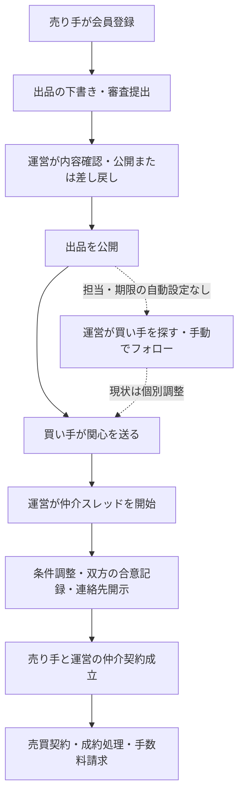
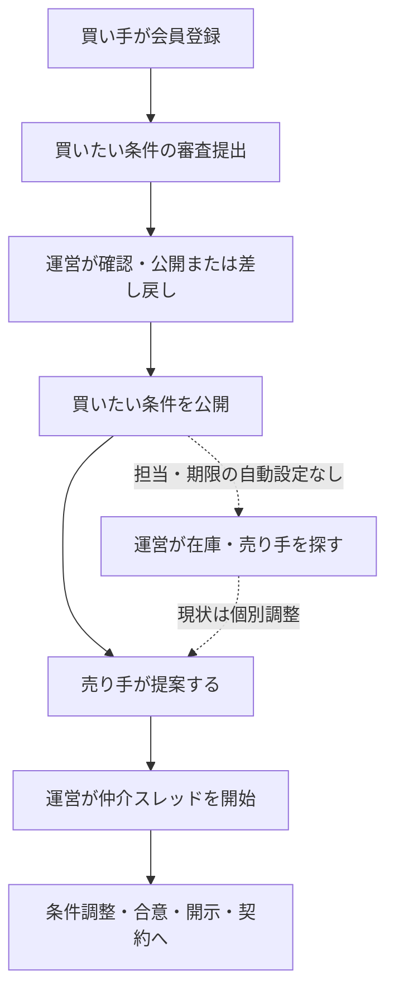

# 売り手・買い手の取引フローとメール通知の検証

検証日：2026年9月18日（日本時間）  
対象実装：`9165ef2`。改善設計は [運営フォロー設計](./trade-operations-plan.md) に分けています。

## 1. 結論

売り手起点・買い手起点のどちらも、審査提出 → 公開 → 関心／提案 → 運営の仲介 → 双方の合意記録 → 連絡先開示 → 契約 → 手数料請求という処理を備えています。ローカルDBで両方向を通し、当事者の割当、メッセージの公開範囲、仲介契約先行、請求の発行を確認しました。

ただし、**公開した案件について、誰が相手を探し、いつ進捗を報告し、いつ再確認するかは自動で組まれていません。** CRMには担当・期限・次の対応を記録できますが、投稿、アプローチ、仲介、契約を一件の商談として引き継ぐ仕組みが不足しています。

現時点で優先したい点は次のとおりです。

| 優先 | 確認した問題 | 運営への影響 |
|---|---|---|
| 最優先 | 公開後の相手探し・進捗報告に担当や期限が自動設定されない | 公開した時点で対応が止まる |
| 最優先 | 成約後も元の投稿が公開中、アプローチが `agreed`、スレッドが `open` のまま | 成約済みの機器に再び問い合わせが来る |
| 最優先 | 公開通知メールのリンク形式が現行の詳細ルートと不一致 | メールから対象案件を開けない |
| 最優先 | 相談者への受付メールが実際の受付処理から呼ばれていない | 相談者が受理されたか分からない |
| 高 | 大半の通知で送信結果・再送状態を保存しない | 「対応済みだが相手は知らない」を検知できない |
| 高 | 契約の `sent` はDB上の状態であり、契約メールの送信を伴わない | 画面の「送付」を実際の送付と誤認する |

## 2. 何を検証したか

| 方法 | 実施内容 | 結果・範囲 |
|---|---|---|
| コード確認 | 受付、審査、検索候補、関心／提案、コメント、仲介、開示、契約、請求、CRM、全メール呼出元 | 本書の現状を整理 |
| ローカルDB統合テスト | リポジトリのマイグレーションをPGliteに適用。売り手・買い手・運営・第三者を分けて操作 | 両方向とも成功。RLS、合意記録、仲介契約先行、請求を確認 |
| API通知テスト | 実APIハンドラ・実テンプレートを実行。DB取得と送信部分を模擬 | 関心／提案、送り先別メッセージ、仲介、開示、成約、提出通知の送り分けを確認 |
| 既存回帰テスト | `npm run test:workflow` | 受付、CRM、投稿、権限、画像、会員区分の既存検証 |
| 本番の読み取り | `/admin`、アプローチ、仲介、仲介契約、売買・請求画面。公開メールのリンク先 | 画面と導線を確認。顧客案件は変更していない |
| 未実施 | 本番の売り手／買い手による新規取引、実メール送信・受信、Resend配信ログ、SMTP設定照合、電子署名、実決済・搬送 | 実配信を含む完全なブラウザーE2Eが完了したとは扱わない |

本番の「今日の対応」では、対応履歴未登録39件・次回予定なし39件・期限超過0件・今日が期限0件でした。これは取得時点の画面集計です。**期限がない案件は期限超過になりません。また、履歴未登録は未対応を意味せず、メールや電話で対応済みの可能性があります。** テストらしい受付も混在しており、39件を実商談数や放置件数として扱うことはできません。

再現用テスト：

```sh
npm run test:workflow
npm run test:trade
```

追加ファイル：`tests/unit/trade-lifecycle-db.mjs`、`tests/unit/trade-notifications.cjs`。外部通信・顧客への送信は行いません。DBテストは実SupabaseのAuth・Storage・Realtimeそのものを再現するものではありません。

## 3. 売り手起点の現状



| 段階 | 誰が何をするか | システム・メール | 運営が次にすること |
|---|---|---|---|
| 会員登録 | 売り手が法人／個人、対応する番号、連絡先等を入力 | Supabase Authで確認メール。登録済みログインユーザーの再開では再送しない | 不完全登録や事業者確認が必要な場合の窓口対応。自動担当割当はない |
| 下書き | 売り手が機器情報・画像を保存 | `draft`。提出通知なし | 原則として審査提出前。催促の自動処理なし |
| 審査提出 | 売り手が提出。差し戻し後も修正して再提出 | `pending_review`。提出者＋運営へ通知 | 機器情報、写真、価格、状態、保守、所在地、売却時期を確認。不足は具体的に伝える |
| 審査 | 運営が `/admin/posts` で公開または理由付き差し戻し | 審査履歴を保存。公開／差し戻しを組織の代表会員へ通知 | 公開とは別に、CRMで担当・次の対応・期限を設定する必要がある |
| 相手探し | 買い手が一覧で探す。運営も買い希望を確認する | 詳細画面に関連候補を表示。候補発見によるメールはない | 買い手候補を探し、条件を確認し、提案履歴を手動で残す。専用の候補管理はない |
| 関心 | 買い手が出品に関心を送る | `approaches.kind=interest/status=new`。買い手・売り手・運営へ通知 | 運営は予算・導入時期と在庫・売却条件を双方に確認する |
| 仲介 | 運営が `/admin/approaches` で開始 | `in_mediation`、仲介スレッド作成。担当 `operator_id` を保存。双方＋運営へ通知 | スレッドのCRM担当・次回予定は別管理。開始操作だけでは設定されない |

## 4. 買い手起点の現状



| 段階 | 誰が何をするか | システム・メール | 運営が次にすること |
|---|---|---|---|
| 買い希望提出 | 買い手がカテゴリ、機種、予算、時期、エリアなどを入力 | `wanted_requests.pending_review`。提出者＋運営へ通知 | 必須条件と希望条件、予算上限、代替機種の可否を確認 |
| 審査・公開 | 運営が審査する | 出品と同様に履歴と通知 | 在庫を探す担当と期限をCRMに設定 |
| 在庫探し | 買い手が関連在庫を見る。運営が売り手を探す | 関連在庫表示のみ。新着入荷を登録者へ知らせる処理は確認できない | 在庫の有無、価格、動作・保守・搬送条件を売り手に確認 |
| 提案 | 売り手が買い希望に機器・金額等を提案 | `approaches.kind=offer/status=new`。売り手・買い手・運営へ通知 | 提案内容の裏付けと買い手の受諾意向を確認 |
| 仲介 | 運営が開始 | 買い手は買い希望の所有組織、売り手は提案元組織として作成 | 売り手起点と同じ共通工程へ |

逆方向の提案は、売り手があらかじめ出品を作っていなくても可能です。`offer` が参照するのは買い希望であり、提供する出品IDの紐付けは必須ではありません。運営は何を提供する提案なのか、機器情報・在庫確認の記録を補う必要があります。

## 5. 両方向に共通する分岐と後工程

### 相談から始める場合

`/contact`、売却・購入の相談フォーム、`/api/consultations` は `consultations` に受け付け、運営に通知します。受付キーにより同一送信の重複保存を防ぎます。相談者向け `consultAck` テンプレートはありますが、この受付処理からは呼ばれていません。

相談と出品・買い希望は別データです。運営がヒアリングして登録につなげる工程、既存相談を投稿・商談へ明示的に引き継ぐ操作は整っていません。相談に関連投稿IDを保持できても、自動で投稿やアプローチを作るわけではありません。

### コメントから始める場合

投稿へのコメントは `threads.kind=qa` を作ります。最初のコメントでは投稿者・コメント送信者・運営に通知されます。以後は相手と運営への通知です。売り手と買い手はスレッド内で直接返信でき、毎回の運営承認は挟まりません。

Q&Aと正式な仲介は別経路です。Q&Aから仲介への昇格APIは確認できず、現状は関心／提案を別途送ってもらう必要があります。過去のQ&Aを仲介側へ自動で引き継ぐ機能もありません。

### 合意から成約・入金まで

| 操作 | 現状の条件・記録 | 通知と残る作業 |
|---|---|---|
| 運営がメッセージ送信 | 全員／買い手のみ／売り手のみを選択。第三者や反対側はRLSで制限 | 指定先と運営へ通知。自分の送信でも運営通知が発生 |
| 双方の合意・連絡先開示 | 開いている仲介スレッドが対象。買い手・売り手それぞれの確認日時・方法・記録先を運営が入力 | `disclosure_events`、`contact_disclosed=true`、アプローチ `agreed`。双方＋運営へ通知。相手の連絡先は保護画面で確認 |
| 仲介契約の作成・送付 | 運営が売り手、対象ID、条件を入力。DBは `sent` | メール送信はない。実際の契約書送付は別途行う必要がある |
| 仲介契約の成立 | 運営が `signed` にする | メール送信・電子署名サービス連携・署名証跡の必須入力はない |
| 売買契約の作成 | `signed` の仲介契約と一致する売り手、買い手、成約額を指定 | DBは `negotiating/contract_status=sent`。実際の契約書送信はない。組織IDを手入力 |
| 成約処理 | 運営が交渉中の売買を成約にする | `contracted/signed`。DBで手数料請求行を作成。売り手・買い手・運営へ通知 |
| 請求送付・入金 | 売り手向けメールは金額案内のみ。請求の詳細は「別途連絡」 | DB上の請求発行は、請求書PDFの発行・送付や代金決済を意味しない。入金消込は運営操作、通知なし |
| 搬送・検収・完了 | DBに `delivered/completed/cancelled` はある | 今回確認した管理画面/APIに一連の更新・通知導線はない |

連絡先開示の合意と、契約への署名は別です。現状、開示RPCは署名済み仲介契約を要求しません。仲介契約先行は「売買契約作成」に対してAPI・DBで保証されます。開示の時点を変える場合は別途業務ルールとして決める必要があります。

## 6. 現在のメール一覧

以下は**コードが送信を試みる条件**です。受信箱に到達した実績を示すものではありません。件名の共通接頭辞「【クリニックマッチ】」は表では省略します。「運営」は `ADMIN_NOTIFY_EMAILS` の宛先群です。

| タイミング・条件 | 宛先 | 件名 | 主な内容・遷移先 |
|---|---|---|---|
| 新規登録の `auth.signUp`／確認メール再送 | 登録メール | Supabase側テンプレートで決まる | 確認リンク。実設定・到達は未確認 |
| 出品／買い希望を審査提出。下書き保存では送らない | 提出した本人 | 売りたい／買いたいの登録を受け付けました | 審査待ちの案内 → `/account` |
| 同上 | 運営 | 新規売りたい／買いたい（審査待ち） | 投稿・組織ID、題名 → `/admin/posts` |
| 運営が公開した後 | 投稿組織の最古の会員 | 売りたい／買いたいが公開されました | 公開案内 → **旧形式URL。下記の不具合参照** |
| 運営が理由付きで差し戻した後 | 投稿組織の最古の会員 | 投稿内容の確認をお願いします | 差し戻し理由 → `/account/listings` または `/account/wanted` |
| 買い手が関心を保存した後 | 買い手本人 | 関心を受け付けました | 運営から連絡する案内 → `/account/approaches` |
| 同上 | 出品組織の最古の会員 | あなたの出品に関心が寄せられました | 運営から連絡・合意後開示の案内 → 同上 |
| 同上 | 運営 | 新規アプローチ（関心） | ID、対象、エリア、申込組織、入力メッセージ → `/admin/approaches` |
| 売り手が提案を保存した後 | 売り手本人 | 提案を受け付けました | 運営から連絡する案内 → `/account/approaches` |
| 同上 | 買い希望組織の最古の会員 | あなたの買いたいに提案がありました | 運営から連絡・合意後開示の案内 → 同上 |
| 同上 | 運営 | 新規アプローチ（提案） | ID、対象、エリア、申込組織、入力メッセージ → `/admin/approaches` |
| 相談の新規保存後 | **運営のみ** | 相談を受け付けました | 本文は受付案内のみ → 該当のCRM詳細 |
| 新しいコメントスレッドの保存後 | 投稿組織の最古の会員 | あなたの投稿にコメントが届きました | 内容確認・返信 → 該当の会員スレッド |
| 同上 | コメント送信者本人 | コメントを送信しました | 相手と運営への通知案内 → 同上 |
| コメントAPIから投稿／追記した後 | 運営 | 新規コメント（要対応） | 対象・冒頭120文字 → 該当の運営スレッド |
| 既存コメントスレッドへコメントAPIから追記 | 相手組織の最古の会員 | 新着メッセージがあります | 会員スレッドへ。送信者への受付メールは初回のみ |
| 会員がメッセージAPIで返信 | 反対側の最古の会員＋運営 | 新着メッセージがあります／新着メッセージ | 会員には本文を含めず、運営には冒頭120文字を含める |
| 運営がメッセージAPIで投稿 | 可視範囲に対応する会員＋運営 | 同上 | `buyer_side` は買い手のみ、`seller_side` は売り手のみ、`all` は双方 |
| 運営が仲介を初めて開始 | 双方の最古の会員＋運営 | 運営が仲介を開始しました／仲介スレッド開始 | 会員・運営それぞれのスレッドへ。重複開始では再送なし |
| 双方の合意記録を保存し初めて開示 | 双方の最古の会員＋運営 | 合意成立・連絡先を開示しました／合意成立・連絡先開示 | 保護されたスレッドへ。メールに連絡先は入れない。重複開示では再送なし |
| 運営が成約処理 | 売り手の最古の会員 | 売買契約成立・手数料のご案内 | 成約額・手数料額、請求は別途案内 → `/account` |
| 同上 | 買い手の最古の会員 | 取引が成立しました | 今後の手続きは運営から案内 → `/account` |
| 同上 | 運営 | 売買成約・手数料請求発行 | 取引ID・成約額・手数料額 → `/admin/deals` |

### 自動メールがないタイミング

下書き保存、候補の発見、新着在庫と買い希望の一致、CRM担当の設定・変更、CRM期限到来・超過、返信待ちの催促、進捗報告、仲介契約の作成・署名済み登録、売買契約の作成、入金消込、搬送・検収・取引終了、失注・辞退には、自動通知の呼出元を確認できませんでした。CRMの「メール」記録は送信機能ではありません。

`consultAck`、`consultToAdmin`、`contactToAdmin`、旧 `qaThreadTo*` はテンプレートの存在だけで運用中と判断しないでください。現行の呼出元と上表を基準にします。

### 宛先と配信の注意点

- 投稿受付は操作した本人へ送りますが、公開通知や相手側通知は `profiles.created_at` が最古の会員のAuthメールへ送ります。投稿者・取引担当者・組織の `contact_email` と一致する保証はありません。
- 取引メールはResend API経由です。`MAIL_FROM` がなければ `クリニックマッチ <noreply@clinicmatch.org>` を使います。運営宛先にもコード内の既定値があり、本番の実効設定は今回照合していません。
- APIキー未設定やResendエラーでは `false` を返します。成功してもResendの受付成功であり、配達完了ではありません。メッセージID・配達・バウンスの記録やWebhook処理は確認できません。
- 相談だけは `pending/sending/sent/failed` と送信試行時刻を保存し、運営画面から手動再試行できます。`sent` も配達確認ではありません。10分以上 `sending` の案件は手動再試行時に回復しますが、二重配信の可能性があります。
- 公開通知のヘルパーは送信失敗の `false` を呼出元に返しません。審査APIの `notificationFailed` が、公開時の失敗を正しく表せない場合があります。
- 初回保存後の通知失敗を、同じ操作の再実行で必ず回復できるわけではありません。投稿受付・仲介開始・開示は重複イベントを抑制するため、通知だけを再送する仕組みが必要です。

## 7. 再現できた問題とコードから分かった不足

| ID | 所見・証拠 | 現状の回避／改善の方向 |
|---|---|---|
| F01 | 公開メールは `/cases/listing/{id}`、`/cases/wanted/{id}`。実ページは `/cases/{id}?type=listing|wanted`。本番で実在する出品の旧形式URLから一覧に戻ることを確認 | 正しい詳細リンクへ統一し、メールから対象案件に到達するテストを追加 |
| F02 | `receiveIntake` は運営通知のみ。旧仕様書の「相談者＋運営」と不一致 | 相談者へ受付番号・次回連絡目安を送る。返信先なしの旧受付は別扱い |
| F03 | ローカル両方向テストで成約・入金後も投稿 `published`、アプローチ `agreed`、スレッド `open`、CRM件数0 | 成約時の投稿停止・関連案件更新・次の事務作業作成を一つの処理にする |
| F04 | `matchListingsForWanted` / `matchWantedForListing` は詳細画面でのみ使用。新着通知や運営タスク生成の呼出元なし | 候補の保存、適合確認、提案、返答期限まで管理する |
| F05 | 候補は同カテゴリの最大30件を取得してスコア上位6件。同カテゴリだけでも40点で候補になる | 予算・必須条件・機器本体／消耗品・期限・残数の不適合を除く。点数は適合保証に使わない |
| F06 | CRMは相談・投稿・アプローチ・スレッドごとの別レコード。案件発生時の自動作成・担当引継ぎなし。契約・請求はCRM対象外 | 統一案件ID、タスク、候補ペア、契約・請求への関連を追加 |
| F07 | `in_progress/waiting` では担当・次の対応・期限必須だが、未整理・保留では未設定を許す | 受付当番と保留再開日を必須化。未割当・期限なしを別枠で監視 |
| F08 | スレッドのCRM連絡先は `seller_org_id` を優先して一組織にまとめる | 売り手・買い手それぞれの窓口と連絡履歴を分ける |
| F09 | 仲介契約の「作成・送付」、売買契約作成は `sent` にするだけ | 下書き・送付済み・署名済みの証跡と通知を分離 |
| F10 | Q&Aから仲介への変換、運営主導の候補ペアから仲介を開始する専用操作なし | 関連履歴を保った昇格と、双方への打診を記録できる導線を用意 |
| F11 | 関心／提案APIは受付の冪等キーなし。スキーマに同一申込の一意制約なし | 二重クリック・再送で商談や通知が重ならないよう制御 |
| F12 | 事業者番号登録と `verified_at` は別。消耗品提出は確認済みを要求するが、会員管理画面には確認完了操作がない | 運営の確認手順・証跡・担当・確認済み更新を画面に用意 |
| F13 | 一般メッセージは保存直後に相手へ見える。自由文の連絡先除去は確認できない | 「運営仲介」「合意後開示」という説明に合わせ、入力注意・検出・運営確認の対象を決める |
| F14 | 成約通知の料率表示は7.5%固定。計算は契約の `commission_rate` を参照 | 例外料率を認めるなら表示も契約から取得。現状は既存の7.5%ルールを維持 |

F03のスレッド `open` 自体は成約後の連絡に必要な場合があります。機械的に閉じるのでなく、「成約後フォロー中」へ移し、誰がいつ終了するかを定めるべきです。複数候補の一つが不成立になっても、元の売却・購入希望を終了させない設計も必要です。

## 8. 実メールまで含めた次のE2E受入条件

専用の売り手・買い手・運営アカウント、分離した検証DB、管理下の受信箱、メールログ閲覧環境を用意して実施します。現顧客の案件やメールを試験に使いません。

| シナリオ | 合格条件 |
|---|---|
| 売り手起点／買い手起点それぞれ | 登録確認 → 提出 → 審査 → 関心／提案 → 仲介 → 合意 → 契約 → 成約がブラウザー操作でつながる |
| メール到達とリンク | 上表の対象受信箱だけに届く。イベントID・プロバイダーID・受信時刻を照合。ログイン後も対象詳細へ戻る |
| 差し戻し・再提出 | 理由を確認して修正・再提出できる。公開前に第三者から見えない |
| 匿名・片側送信 | 開示前に相手の連絡先を表示しない。片側メッセージは反対側へ本文・通知とも漏れない |
| 通知失敗・再試行 | 保存は維持。失敗が運営に見え、通知だけ再送できる。二重登録・二重請求にならない |
| 候補なし・返答なし・辞退 | 次の担当・期限・対応が残る。適切な状態へ進み、放置にならない |
| 相談→登録、Q&A→仲介 | 同じ案件として履歴・担当・連絡先が引き継がれる（改善後の受入条件） |
| 成約後 | 販売可能数に応じて元投稿を停止／更新し、他候補へ案内。請求送付・入金・搬送・検収のタスクが残る（改善後） |

## 9. 根拠となる実装

- 受付・審査：`src/lib/receive-intake.ts`、`src/lib/post-creation.ts`、`src/lib/review-post.ts`、`src/pages/api/listings/`、`src/pages/api/wanted/`
- 候補：`src/lib/matching.ts`、`src/pages/cases/[...slug].astro`
- 関心・提案・コメント：`src/pages/api/approaches.ts`、`src/pages/api/threads/`
- 仲介・開示：`src/pages/api/admin/threads/`、マイグレーション0013・0014
- 契約・請求：`src/pages/api/admin/agreements/`、`src/pages/api/admin/deals/`、`src/pages/api/admin/invoices/`、マイグレーション0001
- CRM：`src/lib/crm.ts`、`src/pages/api/admin/crm/`、`src/pages/admin/crm/`、マイグレーション0011
- メール：`src/lib/notifications.ts`、`src/lib/emails/notify-submission.ts`、`src/lib/emails/recipients.ts`、`src/lib/emails/templates.ts`

既存の `docs/spec.md` と `docs/notifications-cursor-spec.md` は目標仕様も含みます。本書は現在の挙動の監査記録であり、過去の指示書に書かれた機能が実装済みであるとは扱いません。
